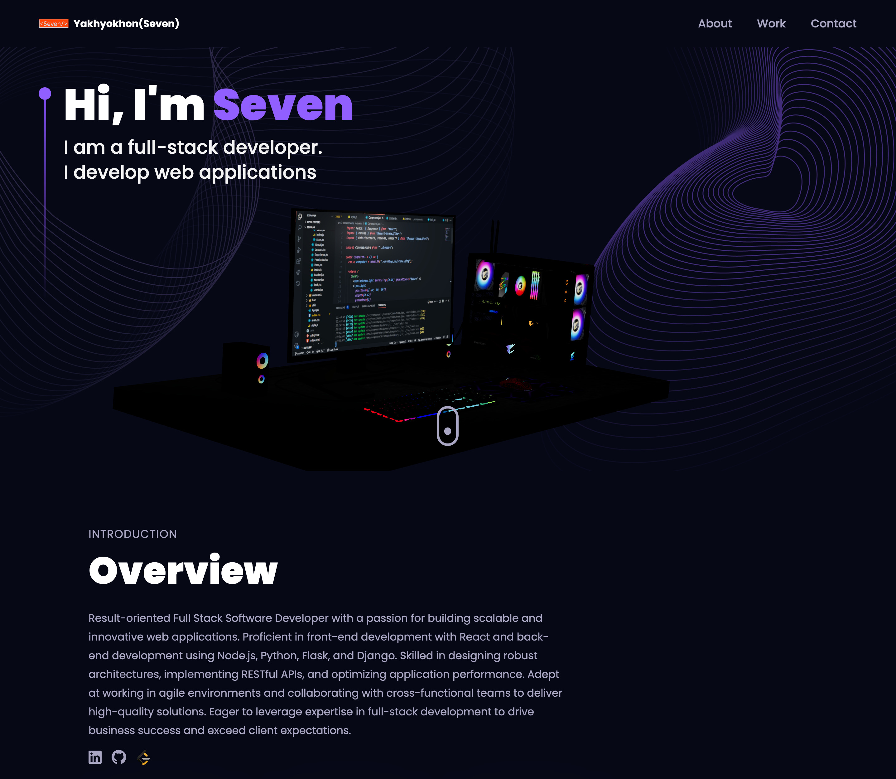

# 3D Developer Portfolio

## Table of Contents

- [Introduction](#introduction)
- [Tech Stack](#tech-stack)
- [Features](#features)

## Introduction

This project is a unique 3D portfolio website designed to showcase my developer skills in a visually captivating way. By building this, I gained experience with:

- **Immersive web experiences:** Utilizing React and Three.js to create a 3D environment
- **3D libraries:** Mastering Three.js and React Three Fiber for creating and manipulating 3D objects
- **Engaging animations:** Implementing animations with framer-motion for a dynamic user experience

## Tech Stack

- **Frontend:** React.js, Three.js, React Three Fiber, React Three Drei, Tailwind CSS
- **Other:** EmailJS (for contact form), Vite (build tool)

## Features

- **Customizable 3D Hero Section:** Showcase personality with a 3D desktop model that you can easily personalize.
- **Interactive Experience & Work Sections:** Engage visitors with smooth animations powered by framer-motion.
- **3D Skills Visualization:** Highlight skills in a visually interesting way using 3D geometries.
- **Animated Projects & Testimonials:** Feature projects and client testimonials with eye-catching animations.
- **Contact Section with 3D Earth:** Impress potential clients with an interactive 3D globe and a functional contact form.
- **Background Animations:** Add depth and dynamism with randomly generated 3D stars in the background.
- **Responsive Design:** Ensure the portfolio looks great on all devices.

